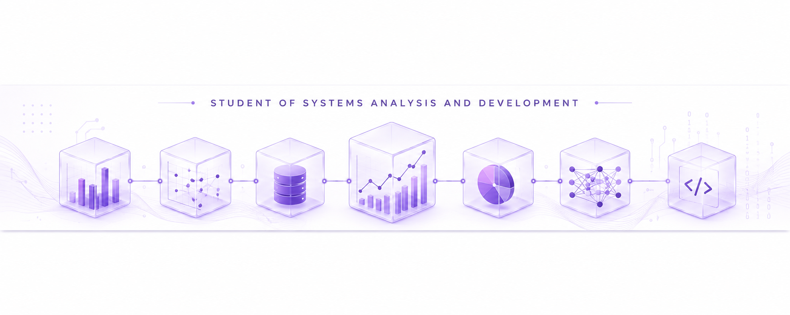

<h1><strong><em>Luana Sousa</em></strong></h1>

<h2><strong><em> Sobre mim</em></strong></h2>

Meu interesse em programação começou quando ao administrar e trabalhar no SEO de um site próprio, tive meu primeiro contato com HTML,CSS e JavaScript. 
Ao aprender um pouco sobre criação de sites resolvi oferecer serviços e percebi que existe grande demanda na área, então comecei a criar meus primeiros sites. 
A necessidade de entender melhor o que havia por detrás do trabalho da qual estava empenhada, me levou a entrar no curso de Análise e Desenvolvimento de Sistema, onde estou conhecendo melhor o back-end e tenho triplo interesse nessa área, em especial <em>"Inteligência Artificial"</em>.

<h3><strong>
Meu foco agora são <i><em>DADOS/INTELIÊNCIA ARTIFICIAL!</em></i>
</strong></h3>

Já tenho em mente diversas tecnologias dessas áreas que quero aprender!

Confesso que quando o assunto é tecnologia, fico muito empolgada! Tenho vontade de aprender, muita coisa.
No entanto meu foco agora é aprimorar meu Python e continuar caminhando para o rumo de Dados de Machine Learning

Também tenho interesse em cibersegurança ,acredito que entender um pouco dessa área me ajudará a construir códigos mais seguros!
  <b><i>Secure Coding</i></b> (programação segura.)

<footer>

<b><em>- Email: lulu.lualinda123@gmail.com</em></b>

-<b><em> GitHub: https://github.com/luana1doce</em></b>

</footer>
